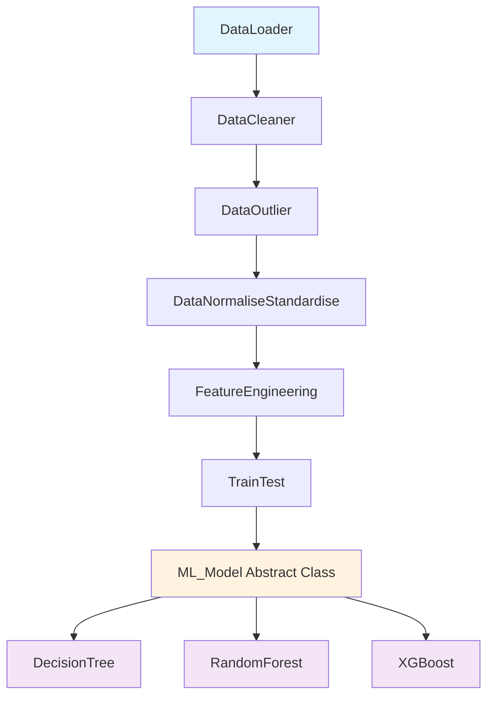
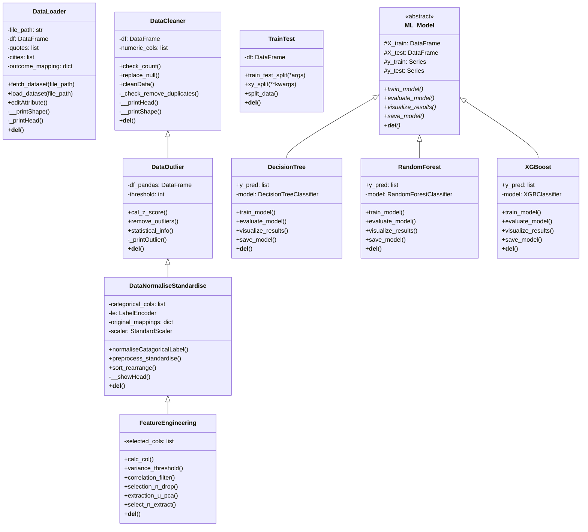

# Diabetes Prediction ML Pipeline

A comprehensive machine learning pipeline for diabetes prediction using multiple classification algorithms. This project demonstrates object-oriented programming principles, SOLID design patterns, and advanced feature engineering techniques.

## 🎯 Overview

This project implements a complete machine learning pipeline for diabetes prediction using a healthcare dataset. The pipeline follows SOLID principles and incorporates multiple design patterns including inheritance, polymorphism, and abstract base classes.

## 📊 Dataset

- **Source**: [Kaggle Healthcare-Diabetes Dataset](https://www.kaggle.com/datasets/nanditapore/healthcare-diabetes)
- **Features**: Pregnancies, Glucose, BloodPressure, SkinThickness, Insulin, BMI, DiabetesPedigreeFunction, Age
- **Target**: Diabetes prediction (Binary classification)
- **Additional Features**: Synthetic Quote and City columns for demonstration

## 🏗️ Architecture Overview

The project follows a modular, object-oriented design with clear separation of concerns:



## 📐 Class Diagram



## 🔧 SOLID Principles Implementation

### 1. **Single Responsibility Principle (SRP)**
- Each class has a single, well-defined responsibility:
  - `DataLoader`: Data loading and initial setup
  - `DataCleaner`: Data cleaning operations
  - `DataOutlier`: Outlier detection and removal
  - `FeatureEngineering`: Feature selection and extraction
  - Each ML model class: Specific algorithm implementation

### 2. **Open/Closed Principle (OCP)**
- Abstract `ML_Model` class allows easy addition of new algorithms
- Inheritance hierarchy enables extension without modification
- New preprocessing steps can be added by extending existing classes

### 3. **Liskov Substitution Principle (LSP)**
- All ML model implementations can be substituted for the base `ML_Model` class
- Inheritance chain maintains behavioral consistency

### 4. **Interface Segregation Principle (ISP)**
- Abstract methods in `ML_Model` define clear interfaces
- Classes implement only the methods they need

### 5. **Dependency Inversion Principle (DIP)**
- High-level modules depend on abstractions (`ML_Model`)
- Concrete implementations depend on the abstract base class

## 🚀 Features

### Data Processing Pipeline
- **Data Loading**: Configurable data loading with synthetic feature generation
- **Data Cleaning**: Null value handling, duplicate removal
- **Outlier Detection**: Z-score based outlier removal (threshold: 3)
- **Normalization**: Label encoding for categorical variables, standard scaling for numerical features
- **Feature Engineering**: Variance threshold filtering, correlation-based feature selection, optional PCA

### Machine Learning Models
- **Decision Tree Classifier**: Interpretable tree-based model
- **Random Forest Classifier**: Ensemble method with 100 estimators
- **XGBoost Classifier**: Gradient boosting implementation

### Evaluation Metrics
- Accuracy Score
- Precision (weighted average)
- Recall (weighted average)
- F1-Score (weighted average)
- Confusion Matrix visualization

## 📁 Project Structure

```
├── README.md
├── paste.txt                          # Main pipeline code
├── Healthcare-Diabetes.csv            # Dataset
├── Models/
│   ├── decision_tree_model.pkl
│   ├── random_forest_model.pkl
│   └── xgboost_model.pkl
├── Preprocessing/
│   ├── scaler.pkl
│   ├── label_encoders.pkl
│   └── selected_cols.pkl
└── Visualizations/
    └── correlation_heatmaps.png
```

## 🛠️ Dependencies

```python
numpy>=1.21.0
polars>=0.18.0
pandas>=1.3.0
scikit-learn>=1.0.0
xgboost>=1.5.0
seaborn>=0.11.0
matplotlib>=3.4.0
scipy>=1.7.0
```

## 📈 Usage

### 1. Training Pipeline

```python
# Load and preprocess data
dl = DataLoader("/path/to/Healthcare-Diabetes.csv")
df = dl.load_dataset("/path/to/Healthcare-Diabetes.csv")

# Clean and engineer features
dns = DataNormaliseStandardise(df)
df = dns.preprocess_standardise()

# Feature engineering
dfse = FeatureEngineering(df)
df = dfse.select_n_extract()

# Train-test split
dtt = TrainTest(df)
X_train, X_test, y_train, y_test = dtt.split_data()

# Train models
models = [
    DecisionTree(X_train, X_test, y_train, y_test),
    RandomForest(X_train, X_test, y_train, y_test),
    XGBoost(X_train, X_test, y_train, y_test)
]

for model in models:
    model.train_model()
    model.evaluate_model()
    model.visualize_results()
```

### 2. Prediction on New Data

```python
# Load saved models and preprocessors
model = pickle.load(open("xgboost_model.pkl", "rb"))
scaler = pickle.load(open("scaler.pkl", "rb"))
label_encoders = pickle.load(open("label_encoders.pkl", "rb"))
selected_columns = pickle.load(open("selected_cols.pkl", "rb"))

# Prepare new sample
sample_input = {
    'Id': 12,
    'Pregnancies': 3,
    'Glucose': 140,
    'BloodPressure': 70,
    'SkinThickness': 20,
    'Insulin': 85,
    'BMI': 32.4,
    'DiabetesPedigreeFunction': 0.6,
    'Age': 45,
    'Quote': "Live well",
    'City': "Houston"
}

# Preprocess and predict
# [Preprocessing steps as shown in code]
prediction = model.predict(processed_sample)[0]
result = "Diabetes" if prediction == 1 else "No Diabetes"
```

## 🎨 Design Patterns Used

### 1. **Template Method Pattern**
- Abstract `ML_Model` class defines the template for model implementation
- Concrete classes implement specific steps

### 2. **Inheritance Hierarchy**
- Progressive data processing through class inheritance
- Each class builds upon the previous class's functionality

### 3. **Factory Pattern (Implicit)**
- Different model classes can be instantiated based on requirements

### 4. **Strategy Pattern**
- Different algorithms implemented as separate classes
- Interchangeable model implementations

## 📊 Performance Metrics

The pipeline evaluates models using multiple metrics:
- **Accuracy**: Overall correctness of predictions
- **Precision**: Ability to avoid false positives
- **Recall**: Ability to identify all positive cases
- **F1-Score**: Harmonic mean of precision and recall

## 🔍 Advanced Features

### Name Mangling
```python
# Private method access using name mangling
dl._DataLoader__printShape()
```

### Method Types
- **Instance Methods**: Standard object methods
- **Class Methods**: Shared across all instances
- **Static Methods**: Utility functions within class context

### Memory Management
- Proper cleanup with `__del__` methods
- Model and preprocessor serialization

## 🚨 Key Considerations

### Data Handling
- Polars used for efficient data processing
- Pandas integration for scikit-learn compatibility
- Proper type casting and null handling

### Model Persistence
- All models and preprocessors saved as pickle files
- Reproducible preprocessing pipeline
- Version control for model artifacts

### Error Handling
- Robust outlier detection and removal
- Graceful handling of missing values
- Validation of feature engineering steps

## 🤝 Contributing

1. Fork the repository
2. Create a feature branch
3. Follow SOLID principles in new implementations
4. Add comprehensive tests
5. Update documentation
6. Submit pull request

## 📝 License

This project is licensed under the MIT License - see the LICENSE file for details.

## 🙏 Acknowledgments

- Dataset provided by [Kaggle Healthcare-Diabetes Dataset](https://www.kaggle.com/datasets/nanditapore/healthcare-diabetes)
- Scikit-learn for machine learning algorithms
- Polars for efficient data processing
- XGBoost for gradient boosting implementation